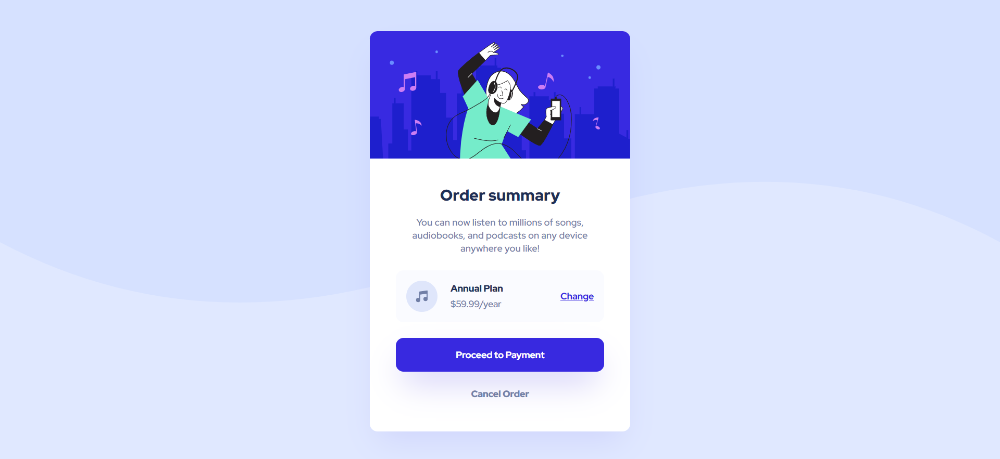
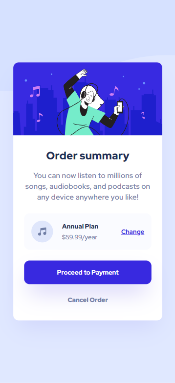

# Frontend Mentor - Order summary card solution

This is a solution to the [Order summary card challenge on Frontend Mentor](https://www.frontendmentor.io/challenges/order-summary-component-QlPmajDUj). Frontend Mentor challenges help you improve your coding skills by building realistic projects.

## Table of contents

- [Overview](#overview)
  - [The challenge](#the-challenge)
  - [Screenshot](#screenshot)
  - [Links](#links)
- [My process](#my-process)
  - [Built with](#built-with)
  - [What I learned](#what-i-learned)
- [Author](#author)

## Overview

### The challenge

Users should be able to:

- See hover states for interactive elements

### Screenshot

Desktop screenshot:


Mobile screenshot:



### Links

- Solution URL: [My Solution UR:](https://github.com/phucnguyen1712675/my-order-summary-component)
- Live Site URL: [My Live Site URL](my-order-summary-component.vercel.app)

## My process

### Built with

- Semantic HTML5 markup
- CSS custom properties
- Flexbox
- Mobile-first workflow
- [React](https://reactjs.org/) - JS library
- [Tailwind CSS](https://tailwindcss.com/) - For styles

### What I learned

```html
<div className="bg-[url('../public/assets/images/pattern-background-mobile.svg')]"></div>
```

```js
module.exports = {
  content: ['./src/**/*.{js,jsx,ts,tsx}', './public/index.html'],
  theme: {
    extend: {
      colors: {
        'pale-blue': 'hsl(225, 100%, 94%)',
        'bright-blue': 'hsl(245, 75%, 52%)',
        'very-pale-blue': 'hsl(225, 100%, 98%)',
        'desaturated-blue': 'hsl(224, 23%, 55%)',
        'dark-blue': 'hsl(223, 47%, 23%)'
      }
    }
  },
  plugins: [require('@tailwindcss/line-clamp')]
};
```

## Author

- Github - [phucnguyen1712675](https://github.com/phucnguyen1712675)
